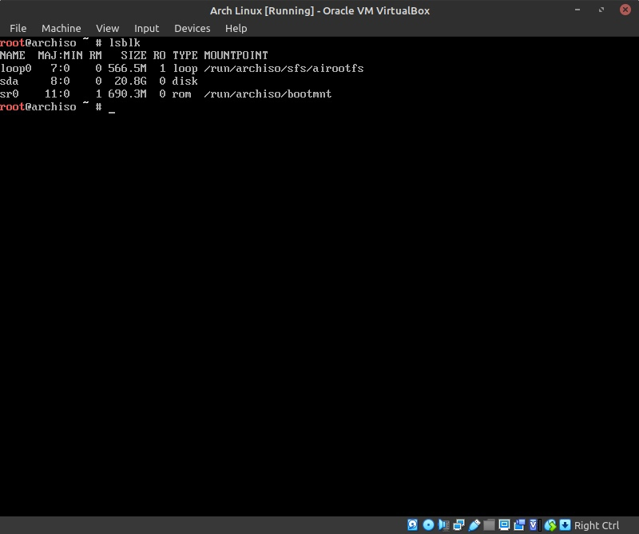
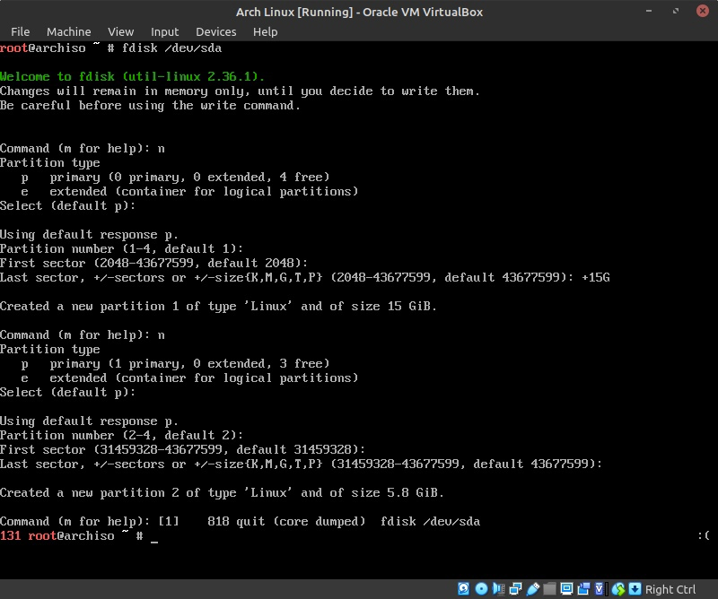

Лучшая связка для работы — Arch Linux + KDE. Почему? Просто потому что Arch Linux — одна из самых гибконастраиваемых систем на ядре Linux,
а KDE — одно из самых передовых рабочих сред на этой платформе, которое стремится быть простым и «не мешать» работать пользователю.

Кто-то скажет, что если вам нужен чистый KDE, то можно обратиться к Kubuntu, а если вам нужен более "красивый Kubuntu",
то нужно юзать KDE Neon, но я вынужден не согласиться с этими суждениями. KDE на любой ОСи может быть любым,
ибо его можно кастомизировать везде по одинаковому, в результате чего, у вас останется разница лишь в пакетных менеджерах ОС,
а также её компонентах (внешне ничего отличаться не будет).

# Установка Arch Linux
Самой установкой ОСи в данный момент мы и займемся. Для начала нужно записать сам установочный образ на флешку с помощью Rufus или dd (если вы на Linux), туториалы к этим двум софтинам можно найти на просторах интернета.

Допустим, что вы записали образ и воткнули флешку до запуска ПК, после чего нажали на клавишу включения/выключения ПК.
Вам нужно выбрать с какого диска вашему компьютеру нужно загрузиться (нужно выбрать флешку).
После выбора флешки, вы попадёте в голую консоль (tty).


После успешной инициализации запуска, вы можете управлять установкой своей ОС полностью из консоли. Стоит сказать, что если вы прервётесь на каком-то моменте
и выключите ПК, то можно будет начать ровно с того момента, на котором вы закончили.

::ContentBookmark{url="https://wiki.archlinux.org/title/Installation_guide"}
::

# Подготовка к установке базовых пакетов
Для того, чтобы установить базовые пакеты (ядро, а также утилиты, которые жизненно необходимы системе),
нам нужно проделать следующие шаги:

- Подключение к интернету
- Разметка разделов
- Форматирование разделов
- Монтирование разделов

## Подключение к интернету
Я всегда делаю этот шаг первым, чтобы проверить корректную работоспособность сетевой карты или Wifi-модуля.

Для подключения по кабелю **ничего делать не нужно**.

Для подключения по WiFi-модулю нужно сделать следующие действия:

```bash
root@archiso~ # sudo systemctl start iwd
root@archiso~ # iwctl

[iwd] station list
# ВЫБИРАЕМ АДАПТЕР, КОТОРЫЙ НАМ НУЖЕН, В МОЁМ СЛУЧАЕ, ЭТО wlan0
[iwd] station wlan0 get-networks
# ИЩЕМ ИМЯ СЕТИ, К КОТОРОЙ НУЖНО ПОДКЛЮЧИТЬСЯ
[iwd] station wlan0 connect WLAN_NAME
# ПОДКЛЮЧАЕМСЯ К СЕТИ И ВВОДИМ ПАРОЛЬ. (WLAN_NAME - имя сети)
```

## Разметка разделов

Для того, чтобы посмотреть какие диски можно разметить в системе, нужно ввести `lsblk`.



После ввода данной команды нам выведется несколько строк с дисками, а также столбцы с их характеристиками.



После того, как мы выберем диск, который хотим разбить на разделы, нам нужно написать команду `fdisk <имя диска>`,
после чего откроется утилита `fdisk`, которая позволит нам быстро его разбить.

С помощью команды `n` мы можем разметить новый раздел. Нам последовательно предложат следующие опции:

1. Создать основной или расширенный раздел
2. Указать номер раздела
3. Указать порядковый номер первого сектора для раздела
4. Указать последний сектор для раздела (можно указать величину в (Кило, Мега, Гига, Пета)-байтах)

Также, в случае чего можно удалить раздел клавишей `d`, указав порядковый номер раздела.

Нам нужно разбить диски так, чтобы у нас были следующие разделы:

1. Раздел под систему
2. Раздел под «файл подкачки» (он же _swap_, место выделяемое для переноса данных из ОЗУ, при переполнении последней)
3. Раздел под Домашнюю Директорию (дополнительно)
4. Раздел под EFI BOOT (если система поддерживает режим UEFI)

## SSD накопитель
В линуксе мягкотелые накопитель в основном подписывают как `nvme<цифра>n<цифра>`.
В остальном установка (пусть даже гибридная, например: `/home` на твердотелый накопитель `/dev/sda`,
а `root` на мягкотелый накопитель `/dev/nvme0n1`) ничем не отличается.

## Форматирование разделов
После разметки разделов настало время решить какие файловые системы будут находиться на этих разделах.
По умолчанию (стандарт де-факто) в Linux используют файловую систему ext4,
однако сегодняшние тенденции сулят хорошее будущее btrfs, пока что она сыровата для использования повсеместно,
так что ограничимся ext4.

```bash
# Форматируем раздел под рут (sdX - номер вашего раздела. sdX писать не нужно, у вас вместо X будет буква и цифра)
mkfs.ext4 /dev/sdX
# Форматируем раздел под домашнюю директорию (вместо Y - буква и цифра вашего раздела)
mkfs.ext4 /dev/sdY
# Форматируем раздел подкачки (Z - буква и цифра вашего раздела)
mkswap /dev/sdZ
```

## Монтируем разделы
Нужно будет смонтировать следующие разделы:

- Раздел для root (исходная директория для системы)
- Раздел для /home (домашняя директория)
- Раздел подкачки
- (*Дополнительно*): Раздел EFI

```bash
# Монтируем диски командой mount
# Монтируем root
mount /dev/sdX /mnt

# Монтируем /home, создав папку в уже примонтированном к /mnt root
mkdir /mnt/home
mount /dev/sdY /mnt/home

# Монтируем раздел подкачки
swapon /dev/sdZ

# Дополнительно: если ваша система запускается из UEFI-режима, то вы должны также примонтировать EFI-раздел.
# Если такового раздела заранее не имеется (у вас нет систем на ПК), то вы должны его создать (выделить под него место с помощью fdisk, как мы делали раньше (желательно 500МБ)), форматировать его в fat32
# Данный шаг применяется, если раздела раньше не имелось. Если вы перепишете уже существующий раздел, то не сможете загрузиться в другие системы, так как на этом разделе хранятся все загрузчики. Вместо I - буква и цифра раздела (сейчас и далее).
mkfs.fat -F32 /dev/sdI

# Монтируем данный раздел к /mnt/boot/efi
mkdir -p /mnt/boot/efi
mount /dev/sdI /mnt/boot/efi
```

# Установка базовых пакетов системы
Базовые пакеты для системы устанавливаются одной командой:

```bash
pacstrap /mnt base base-devel linux linux-firmware
```

Так как линукс при загрузке монтирует некоторые разделы,
необходимо объяснить ему какие разделы нужно монтировать и куда.
Можно делать это вручную, однако существует утилита `genfstab`,
которая облегчает нам данную рутинную работу.

Данной командой вы сможете заполнить файл, который отвечает за то, какие разделы куда монтируются при загрузке ОСи.

```bash
genfstab -U -p /mnt >> /mnt/etc/fstab
```

# Вход в систему
**Ничего перезапускать не нужно**.
Мы можем зайти в нашу систему прямо из загрузчика, с помощью команды:

```bash
arch-chroot /mnt
```

После того, как мы войдем в нашу систему консоль
станет несколько другой (потеряет цвета), однако это не мешает нам продолжить установку.

## Установка менеджера беспроводных сетей, загрузчика систем, редактора, а также других полезных программ

Для того, чтобы мы могли подключиться при последующих запусках к интернету мы должны
установить и активировать демоны (демоны — процессы, которые запускаются в фоне) некоторых утилит.

```bash
# Устанавливаем необходимые пакеты
pacman -Sy --needed xorg
pacman -Sy networkmanager nano neovim neofetch grub efibootmgr os-prober
# Активируем демоны
systemctl enable NetworkManager
# Данный демон нужно активировать если у вас мягкотелый накопитель
systemctl enable fstrim.timer
```

## Конфигурация системы

Первее всего нужно редактировать файл локалей, чтобы у системы был определённый язык и программы знали на каком языке нужно общаться с пользователем.

Я обычно выполняю следующую команду:

```bash
sed -i 's/#en_US\.UTF-8 UTF-8/en_US\.UTF-8 UTF-8/' /etc/locale.gen && \
  locale-gen && \
  locale > /etc/locale.conf
```

Хорошо бы просто знать её наизусть, если вы не знаете как работать с ReGeX и `sed`,
однако объяснить что происходит всё же стоит.

В первой части мы убираем комментарий из файла `/etc/locale.gen` (который в будущем будет использоваться для создания локали),
комментарий мы убираем из строки «en_US.UTF-8 UTF-8», для того чтобы система была на русском языке,
ибо я советую ставить именно его, потому что не все приложения переведены.

Команда `locale-gen` генерирует локаль, команда `locale` показывает какая в системе локаль
(её мы перенаправляем в файл `/etc/locale.conf`).

Далее устанавливаем часовой пояс:

```bash
# Устанавливаем часовой пояс Москвы
ln -sf /usr/share/zoneinfo/Europe/Moscow /etc/localtime && hwclock --systohc --utc
```

Далее пишем в файл `/etc/hosts` следующее:

```bash
127.0.0.1  localhost
::1        localhost
```

Выбираем как мы назовём нашу хост-машину (название компьютера) и записываем это в `/etc/hostname`:

```bash
Inspiron-3581
```

## Добавление пользователя

Следующим шагом будет создание пользователя:

```bash
useradd -m -g users имя_пользователя
passwd имя_пользователя
# Также нужно изменить пароль для администратора (root)
passwd
```

Также, для того чтобы работала команда sudo нам нужно добавить нового пользователя в группу «wheel»:

```bash
groupmems -a имя_пользователя -g wheel
```

## Изменение файла sudoers

Файл `sudoers` отвечает за то, какие пользователи смогут использовать `sudo`.

Нам нужно изменить его так, чтобы пользователи с группой `wheel` смогли использовать `sudo`:

```bash
EDITOR=nano visudo

---

# Тут мы ищем следующую строку
# %wheel ALL=(ALL) ALL

---

# Переделываем её в следующую строку (раскомментируем)
%wheel ALL=(ALL) ALL
```

После этого каждый пользователь с группой `wheel` сможет использовать `sudo`.

## Установка загрузчика

```bash
os-prober
grub-install
grub-mkconfig -o /boot/grub/grub.cfg
```

После этого нажимаем Ctrl + D (если всё прошло успешно и не было никаких ошибок, в противном случае
— гуглим ошибку, ни в коем случае не выходим, ибо все ОС могут слететь) и вводим `reboot`.

Логинимся в нашей системе и начинаем установку KDE.

# Новая система
Мы уже установили Arch Linux, однако пока что это просто голая консоль. Сначала подключаемся к интернету, чтобы исправить это:

```bash
nmcli dev wifi
# < высветятся сети >
nmcli dev wifi con <имя сети> -a
```

> Стоит напомнить, что если вы соединяетесь с помощью PPPoE кабеля, то ничего делать не нужно.

## Установка KDE

```bash
sudo pacman -Syyu
sudo pacman -Sy plasma dolphin firefox konsole ark unzip unrar sddm kate \
  vlc elisa alsa alsa-lib alsa-utils pavucontrol gwenview libreoffice-still
```

Вся установка производится одной этой командой. В конце нам нужно будет запустить менеджер рабочих сред (он же экран для логина):

```bash
sudo systemctl enable --now sddm
```
